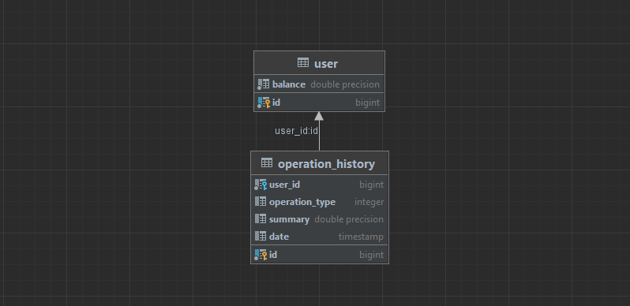

# Spring_mvc_app_bank-api

    API
на данный момент реализованно api для:
1)получения баланса пользователя getbalance()
2)съёма денег takemoney(), 
3)вложения денег putmoney()
4)отображение совершенных операций getOperationBalance()

    SITE

также с использованием thymeleaf сделана графическая реализация этих же функций +
1)создание, удаления пользователей createuser()
2)отображение списка пользователей deleteuser()
3)перевод между пользователями transfer()

    DATABASE

dump файлы хранятся в дериктории src/main/resources/DB_copy 
создана таблица для хранения пользователей
создана таблицы для хранения списка совершенных операций

